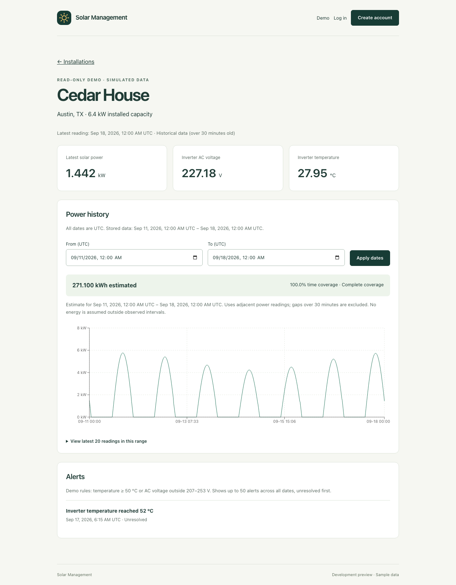
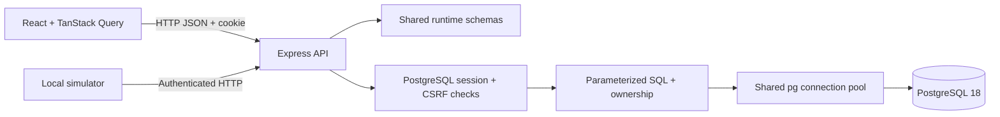

# Solar Management

A solar monitoring project being rebuilt in small, tested stages to develop and demonstrate full-stack engineering skills.

The starting point is an AI-assisted JavaScript prototype called Solar Dashboard. This repository records a new implementation and the reasoning behind it, beginning with an examination of the prototype.

## Current status

**Checkpoints 1–6 implemented. Container deployment and recovery checks pass in CI; public hosting awaits connection details. Learning tasks are deferred to [questions.md](questions.md).**

Visitors can explore a read-only demo or register, log in, and manage their own installations. PostgreSQL persists accounts, sessions, and sites. The API validates inputs, checks ownership, protects writes with CSRF tokens, and rate limits account attempts. Monitoring includes stored simulated readings, date-filtered charts, energy estimates with coverage, and resolvable demo-rule alerts. Public deployment remains pending.

## Run locally



Use Node 24, npm 11 or newer, and PostgreSQL 18. If you use nvm, run `nvm use` first. On macOS, PostgreSQL is available through `brew install postgresql@18`; make its binaries available in your PATH.

```sh
npm ci
cp .env.example .env
npm run db:local:start
npm run db:migrate
npm run db:seed
npm run dev
```

Open [the development app](http://127.0.0.1:5175). The API listens on port 3001; Vite forwards the browser's `/api` requests to it. Port 5175 avoids the other local project already using 5173. Both servers bind to loopback by default.

`npm run dev` starts two servers and a shared-code compiler watcher. Stop them together with Ctrl+C. To run them in separate terminals for debugging, use `npm run dev:api` and `npm run dev:web`; rebuild shared code with `npm run build:shared` if you edit it in that mode.

If API port 3001 is occupied, run `API_PORT=3002 npm run dev`; both the API and proxy will use that value. Keep API port overrides in the shell so both processes receive them.

The local database script uses `pg_config --bindir` (or your `PG_BIN` override). It creates a project-owned cluster in ignored `.local/postgres` on loopback port 55432, with separate `solar_management_dev` and `solar_management_test` databases. It does not start or modify a system PostgreSQL service. The local cluster uses passwordless trust authentication for local development only. Deployment will use private container networking and credentials.

`npm run db:local:stop` stops this cluster; starting it again preserves data. Ctrl+C on the app does not stop PostgreSQL. Logs are in `.local/postgres.log`. Rerun the seed to restore sample values without duplicating their IDs. Existing `.env` files should be edited rather than overwritten. On another PostgreSQL installation, create separate development/test databases and set their URLs in `.env` instead of using the local cluster script.

`npm run build` compiles the production frontend and server. Production startup (`npm start`) requires `APP_ORIGIN` set to the exact public HTTPS origin and `TRUST_PROXY` configured for the known private proxy path. Secure cookies require HTTPS; use `npm run dev` for local HTTP development. Container and tunnel deployment is checkpoint 7.

## Verify changes

```sh
npm run check
npx playwright install chromium
npm run test:e2e
```

`check` runs ESLint, TypeScript checks, unit/API/UI tests, and production builds. PostgreSQL must be running. API tests migrate and clear only `solar_management_test`, so reserve that database for tests. Browser tests also use `solar_management_test`, applying migrations and seeding samples before starting their own servers. Run API and browser tests sequentially and stop an existing `npm run dev` session first. GitHub Actions runs the checks against PostgreSQL 18 on pushes to main and pull requests.

The container CI job also builds the production image, checks Compose startup/migrations, restarts containers, verifies backup restoration, and runs browser scenarios through a local HTTPS proxy. A separate recovery scenario checks database-outage responses and keeps an authenticated browser session through restarts, rollback to a preceding compatible revision, and return to the current image. See [deployment and recovery](docs/deployment.md) for Mac mini setup, Cloudflare routing, logs, backups, and rollback. Public access is not yet verified.

## Learn the project

1. [Understand the original system](docs/checkpoints/01-understand-original.md): architecture, data model, and a request traced through the code to the database.
2. [Feature review](docs/feature-review.md): what exists, what the evidence supports, and what to retain, redesign, or defer.
3. [Checkpoint 1 exercises](docs/checkpoints/01-exercises.md): explain the request, investigate a measurement, and reason about energy.
4. [Checkpoint 2 walkthrough and exercise](docs/checkpoints/02-foundation.md): follow the new request, run the tests, and debug a connection failure.
5. [Checkpoint 3 walkthrough and exercise](docs/checkpoints/03-persistence.md): follow a database query and edit a stored installation.
6. [Checkpoint 4 walkthrough](docs/checkpoints/04-accounts.md): sessions, ownership, validation, and security tradeoffs.
7. [Questions and tasks for later](questions.md): the consolidated learning backlog.
8. [Monitoring and alert notes](docs/checkpoints/05-monitoring-and-alerts.md): units, energy estimates, retry safety, and the HTTP simulator.
9. [Rebuild roadmap](docs/roadmap.md): the agreed design and remaining checkpoints.

## Source layout



| Directory | Responsibility |
| --- | --- |
| `client/` | React interface, TanStack Query, and browser API requests |
| `server/` | Express features, shared database pool, migrations, seed, and API tests |
| `shared/` | TypeScript API contracts and runtime validators |
| `e2e/` | Browser tests against the running frontend and API |
| `docs/` | Walkthroughs, exercises, design review, and roadmap |

One root lockfile records dependencies for all three npm workspaces. Build output and dependencies are ignored by Git.

## First-release features

Users can manage solar installations, view stored readings and energy estimates, and resolve rule-based alerts. Visitors can explore a shared, read-only demo or register to manage their own sites. All first-release telemetry is clearly labeled as simulated. Samples cover September 11–18, 2026 (UTC); their actual dates and coverage appear in the UI.

Run `npm run simulate` after configuring a registered account and owned site as described in the monitoring notes. The simulator submits readings through the HTTP API.

The planned stack is React and TypeScript, an Express API, and PostgreSQL accessed through parameterized SQL. The production application will run in containers on a Mac mini behind an existing Cloudflare Tunnel.

Forecasting, PDF reports, real hardware integration, and battery monitoring are deferred until the monitoring core is understood and tested.

## How the rebuild works

Each checkpoint has a concrete result, an explanation, relevant verification, and a hands-on exercise. Learning questions and exercises live in `questions.md`; implementation continues without waiting for answers, as requested on September 18, 2026. Commits record completed changes as they happen; notes distinguish implemented behavior from future plans.

The original application remains a separate reference. Source paths in the walkthrough refer to that original project, not files in this repository. Important excerpts are included so the walkthrough can also be read on GitHub.
