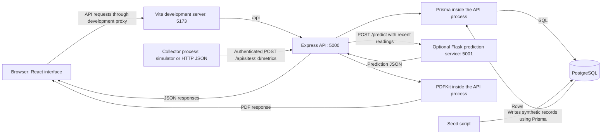
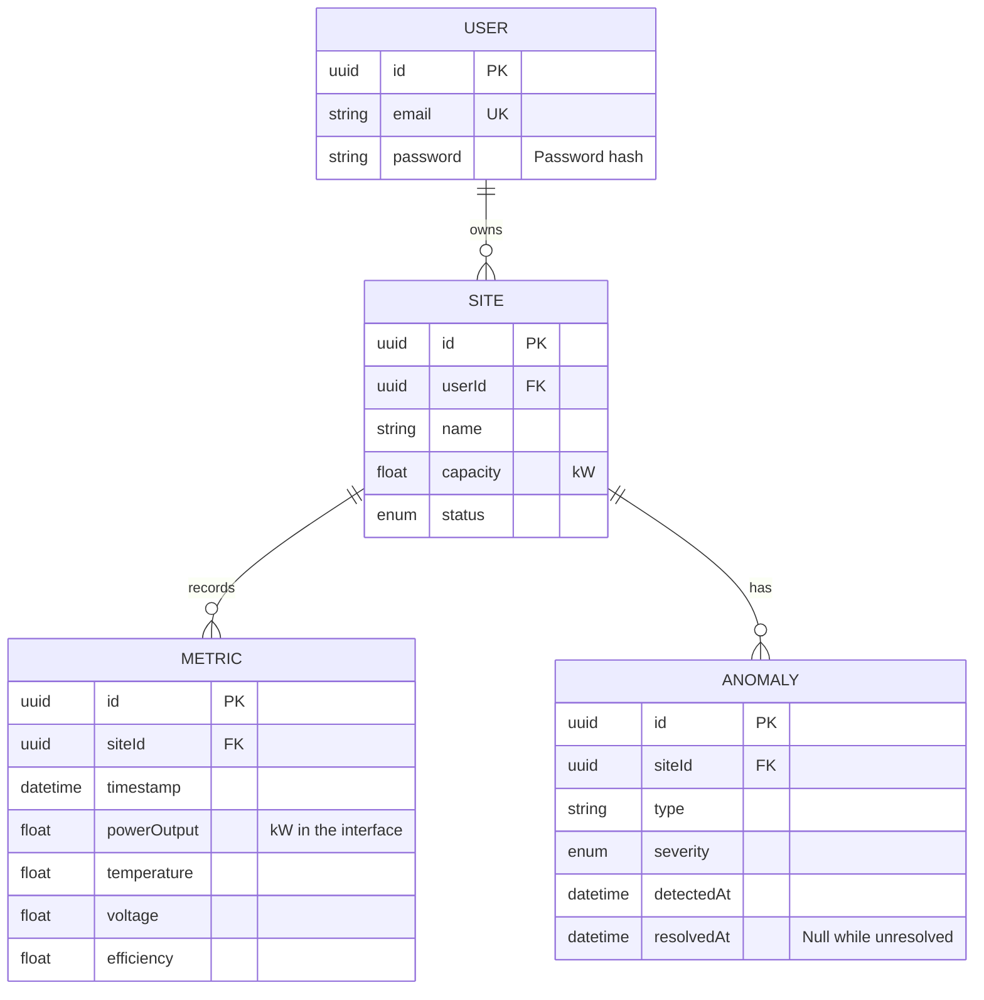

# Checkpoint 1: understand the original system

The original dashboard stores and displays measurements associated with solar installations. Its central relationship is **a user owns sites; each site has readings and alerts**. A chart is a view of those records.

This walkthrough describes the original JavaScript prototype. File references below belong to that separate `solar-dashboard` directory. The new TypeScript application has not been implemented yet.

## 1. The processes and their responsibilities



| Part | Responsibility | Original entry point |
| --- | --- | --- |
| React | Handle navigation and forms; request data; render cards, charts, and alerts | `client/src/App.jsx` |
| Vite | Serve development assets and forward `/api` requests to the API | `client/vite.config.js` |
| Express | Receive HTTP requests, authenticate users, validate input, invoke application logic, return responses | `server/index.js` |
| Prisma | Translate application database operations into SQL and map results into JavaScript objects | `server/models/schema.prisma`, `server/services/siteService.js` |
| PostgreSQL | Persist records and enforce the declared primary keys, unique constraints, and relationships | The database selected by the server configuration |
| Collector | Obtain readings, convert their shape, and submit them to the API | `collector-service/src/collectorRunner.js` |
| Flask | Accept recent readings and calculate prediction output | `ml-service/app.py` |

Prisma and PDFKit are libraries running inside Node, not separate network services. The React code runs in the browser. In development, Vite is another process serving the frontend; it is not the application database or API.

### A second, independent runtime exists

`preview-server.js` serves the built frontend and reimplements the API on port 5174 using JavaScript arrays. It seeds those arrays when it starts and does not use PostgreSQL. Restarting it regenerates its data.

Therefore, successfully using the preview demonstrates that runtime's behavior. It does not establish that the PostgreSQL-backed API works. The rebuild will use one application implementation with seeded PostgreSQL data for its demo.

## 2. What is stored



This is a simplified view of `server/models/schema.prisma`, omitting descriptive fields and some timestamps. `Site.capacity` is configured installation capacity, not a measurement of current power. `Metric` rows are observations; `Anomaly` rows record detected or seeded conditions.

An alert is associated with a site, but the original schema does not link it to the particular reading that caused it. The schema has no declared unique constraint on `(siteId, timestamp)` and no declared compound index for reading history. Primary keys and the unique email field do have their associated uniqueness enforcement.

## 3. Trace a site-detail request

Imagine an authenticated user visiting `/sites/<site UUID>`. That is a frontend route. The corresponding data endpoint is `/api/sites/<site UUID>`.

### A. React requests data

`client/src/pages/SiteDetail.jsx`, in `loadData`, performs these calls in sequence:

```js
await fetchSite(id);
const to = new Date().toISOString();
const from = new Date(Date.now() - 7 * 86400000).toISOString();
await fetchMetrics(id, { from, to, limit: 1000 });
await fetchAnomalies(id);
```

Those functions come from `SiteContext`, exposed through `useSites`. A React effect invokes `loadData` when the route's site ID changes.

This path makes three requests, not a single request containing the whole page. Authentication initialization can also request `/api/auth/me`; development StrictMode can cause additional effect executions. The three calls above describe one execution of the page's loading function, not a guaranteed total browser network count.

`SiteContext.fetchSite` calls `api.getSite(id)`. The API helper in `client/src/services/api.js` adds the `/api` base path and an `Authorization: Bearer <token>` header using the token in browser local storage. With the default development configuration, Vite forwards that request to Express on port 5000 without removing `/api`.

### B. Express identifies and checks the request

The route is assembled in three places:

| File | Contribution |
| --- | --- |
| `server/index.js` | Mount all routes at `/api` |
| `server/routes/index.js` | Mount site routes at `/sites` |
| `server/routes/sites.js` | Handle `GET /:id` |

The site's router first runs `authenticate`. `server/middleware/auth.js` verifies the JWT and places its user ID in `req.user.userId`. This verifies the token's signature and expiry; it does not itself query the site's owner.

The route then validates that the site ID has UUID syntax. A valid UUID is only a valid identifier format. It does not establish permission to read that record.

The controller passes the two identities to the service:

```js
const site = await siteService.getSite(req.params.id, req.user.userId);
res.json(site);
```

`req.params.id` identifies the requested site. `req.user.userId` identifies the caller using the verified token. The server does not accept an owner ID supplied in the request body for this operation.

### C. The service asks the database

In `server/services/siteService.js`, `getSite` uses:

```js
const site = await prisma.site.findFirst({
  where: { id: siteId, userId },
  include: {
    metrics: { orderBy: { timestamp: 'desc' }, take: 1 },
    _count: {
      select: { anomalies: { where: { resolvedAt: null } } },
    },
  },
});
```

Both IDs are part of the database predicate. A record owned by somebody else fails that predicate, just like a nonexistent site. The service returns a 404 in either case.

Here is a **conceptual SQL equivalent**, not a captured Prisma query or a promise about the number of SQL statements it executes:

```sql
SELECT id, name, location, capacity, status
FROM sites
WHERE id = $1 AND "userId" = $2
LIMIT 1;

-- Run related lookups only after the ownership lookup succeeds.
SELECT id, timestamp, power_output, temperature, voltage, efficiency
FROM metrics
WHERE "siteId" = $1
ORDER BY timestamp DESC
LIMIT 1;

SELECT COUNT(*) AS active_anomalies
FROM anomalies
WHERE "siteId" = $1 AND resolved_at IS NULL;
```

`$1` represents the requested site UUID, and `$2` the authenticated user's UUID. They are bound values, not text pasted into SQL. These examples use the prototype's actual mappings: table names such as `sites`, mapped columns such as `power_output`, and unmapped camel-case columns such as `"userId"`. The new schema will be designed separately.

### D. The response becomes interface state

The service converts the included one-element metrics array into `latestMetric` and the relation count into `activeAnomalies`. It marks the internal `metrics` and `_count` properties as `undefined`, so they are omitted from the JSON object.

Express serializes that object. Axios reads the response. `SiteContext.fetchSite` calls `setSelectedSite(res.data)`, scheduling a React render. The page can then display the site name and its latest measurement cards.

The subsequent `/metrics` request obtains reading history for the chart; `/anomalies` obtains alert details. Each performs an ownership lookup in the metrics service. The latest-reading endpoint also exists, but this page obtains its latest reading from the site-detail response instead.

### E. Follow the failure path too

| Situation | Original behavior |
| --- | --- |
| Token missing, invalid, or expired | Authentication rejects the request with 401; the browser's API helper clears authentication state and redirects outside the login/register pages |
| Site ID has invalid UUID syntax | Validation returns 400 |
| Site missing or owned by another user | The site service returns 404 |
| Site has no readings | Site response includes `latestMetric: null`; history can be an empty array |
| Database operation fails | Central error handling maps the error; known Prisma request errors are handled differently from otherwise unhandled errors |

The frontend has weaknesses worth changing: `fetchSite` retains a previous selection while a new request loads and rethrows on failure, while the page does not catch the rejected loading promise. Metric and anomaly loaders catch their own errors. All these operations share one loading flag and one error value. A visible page is therefore not sufficient evidence that every dataset on it loaded successfully.

## 4. Where the readings come from

- `server/seed.js` writes synthetic users, sites, readings, and alerts directly through Prisma. It deletes the existing rows in all four application tables first; it is a reset script, not a read-only demo command.
- `collector-service/src/adapters/simulator.js` generates readings programmatically. They remain synthetic after being stored in PostgreSQL.
- `collector-service/src/adapters/httpJson.js` fetches a configured JSON endpoint and maps its fields. The code exists; a connection to actual equipment has not been demonstrated in this checkpoint.
- Modbus TCP and serial JSON adapters currently throw explicit scaffold errors.
- The preview server generates its own data in memory independently of the main API.

The collector normalizes samples before posting them to the API. Its normalizer can combine different measurement meanings: AC voltage, battery voltage, and PV voltage all feed `voltage`; battery state of charge can feed `efficiency`. Once saved, the compact metric record has lost that distinction.

Ingestion also applies rules. Those alerts are separate from the random alerts inserted by the seed script. Resolving an alert updates `resolvedAt`; it does not send a command to equipment or prove a physical fault has been repaired.

## 5. Evidence and next step

This checkpoint inspected source code, route wiring, schemas, and package scripts. Two pure normalizer examples were executed and checked against exact expected values: a 6000 W inverter sample becomes 6 kW, and a battery-only sample with 40% charge becomes an `efficiency` of 40. Neither required starting a server or accessing a database.

The full application, generated SQL, hardware connections, ML accuracy, and deployment have not been runtime-validated here. The [feature review](../feature-review.md) distinguishes those limits from confirmed source behavior.

Continue with the [checkpoint exercises](01-exercises.md), then discuss the answers before building the foundation.
