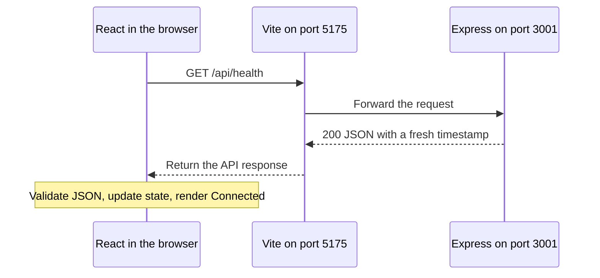

# Checkpoint 2: the first browser-to-API feature

This checkpoint makes one complete interaction work: open a page, ask the server whether it is reachable, validate its reply, and display the result. There are no database queries or simulated solar values yet.

## Run and observe

From the repository root, with Node 24 and npm 11 or newer:

```sh
npm ci
npm run dev
```

Open http://127.0.0.1:5175. You should briefly see a pending state and then **Connected**. Expand **View API response** to inspect the actual server reply. **Check again** makes another request and updates the server timestamp.

The endpoint can also be called without React:

```sh
curl -i http://127.0.0.1:3001/api/health
```

It returns HTTP 200 and JSON shaped like this; the timestamp is generated when the request arrives:

```json
{
  "status": "ok",
  "service": "solar-management-api",
  "timestamp": "2026-09-16T12:00:00.000Z"
}
```

This is a connectivity check, not a claim that a database, hardware connection, or whole installation is healthy. Those dependencies do not exist in this implementation yet.

## Follow the request



1. `client/src/main.tsx` mounts `App` into the HTML root element.
2. `client/src/App.tsx` starts in the checking state. Its effect calls `getHealth` when the component mounts or the retry counter changes.
3. `client/src/api/health.ts` sends a relative request to `/api/health`. The request has a five-second timeout and can be aborted when the component unmounts.
4. `client/vite.config.ts` forwards `/api` requests to the API on port 3001. The browser still addresses the frontend origin, so this development interaction does not need a separate CORS policy.
5. `server/src/app.ts` handles the route and returns a JSON object with `Cache-Control: no-store`.
6. The client checks the HTTP status, parses the JSON as `unknown`, and validates it with `isHealthResponse` from `shared/src/index.ts`.
7. `App` stores either the validated response or an error. React renders the appropriate state. A retry first returns the screen to the checking state.

The response type is a discriminated union in the component: checking has no data, connected has a response, and error has a message. Code cannot accidentally access a response in the error branch without TypeScript objecting.

The browser displays the timestamp in its local time zone and includes the zone in the label. The API supplies an ISO timestamp in UTC. React StrictMode is enabled: during development an effect can be set up, cleaned up, and set up again. Aborting abandoned requests and checking for cancellation prevents them from overwriting the current screen.

## Why these files are separate

| Piece | Reason |
| --- | --- |
| `server/src/app.ts` | Defines behavior without opening a network port, making the application straightforward to test. |
| `server/src/index.ts` | Chooses the address/port, starts the HTTP listener, and handles startup/shutdown. |
| `client/src/api/health.ts` | Owns HTTP and response validation; the component owns presentation. |
| `shared/src/index.ts` | Gives both sides the same response shape and provides a runtime validator. |
| Root `package.json` | Coordinates the workspaces so one install and a few commands operate the project. |

The shared type is a compile-time check. It does not make received JSON trustworthy: TypeScript types disappear from the emitted JavaScript. The validator checks actual values in a response. A server sending `{ "status": "ok" }` without the other fields produces an error state rather than a misleading success.

This is the first reason for a shared workspace. It is a local package linked by npm, not another running web service. The compiler builds its JavaScript and declarations before the client/server start, and watches it during `npm run dev`.

We use a small effect and native fetch here to make the first request explicit. Routing, TanStack Query, and charting will be introduced with the features that need them.

## Development versus production

In development, Vite serves React and forwards API requests. `tsx` runs the TypeScript server and restarts it when its code changes. A third process watches and compiles shared code. `concurrently` starts these together and stops the others if one exits.

In production mode, there is one HTTP process:

```sh
npm run build
npm start
```

Stop the development API first. Open http://127.0.0.1:3001. Express now serves the compiled React files as well as `/api/health`; Vite is not running. Unknown `/api` paths remain JSON 404s instead of silently receiving the frontend HTML. A browser route can receive the frontend entry page, ready for routing in a later checkpoint.

The application binds to `127.0.0.1` by default for local use. `API_PORT` changes the API port, and `API_HOST` changes the listener address. Container networking and public hosting will be configured at checkpoint 7.

## What the checks establish

Run `npm run check` for linting, type checking, tests, and production builds. For real-browser checks, install Chromium with `npx playwright install chromium`, stop any existing development session, then run `npm run test:e2e`.

| Check | Behavior covered |
| --- | --- |
| Shared-contract tests | Accept an expected reply; reject missing, incorrectly typed, or invalid fields. |
| API tests | Return a fresh valid response; preserve JSON 404s; serve frontend HTML in the production configuration. |
| React tests | Pending and connected states; failed request and retry; malformed replies; HTTP errors; cancellation on unmount. |
| Browser tests | Reach the real API through Vite, refresh the response, and recover from a failed request at mobile width. |

These tests establish the first interaction. They do not establish persistence, login security, telemetry accuracy, or deployment readiness. GitHub Actions runs the same checks on main and pull requests.

The dependency lockfile records the versions used. TypeScript is kept on the 6.0 line because the selected TypeScript ESLint integration does not yet declare support for 7. The jsdom version supports the installed Node 24.14 runtime. These are compatibility decisions, not reasons to upgrade the user's global tools.

## Your exercise: break and repair the connection

1. Stop `npm run dev` with Ctrl+C.
2. Run `npm run dev:api` in one terminal and `npm run dev:web` in another.
3. Open the page and confirm that it connects.
4. Stop only the API terminal. Click **Check again** in the page and inspect the failed `/api/health` request in the browser's Network panel.
5. Start the API again and click **Try again**. Confirm that the same page recovers.

Answer in your own words:

- Why can the page remain visible while the API is stopped?
- Which process generated the timestamp shown in the reply?
- Why do we validate JSON when we already have a TypeScript interface?

Optional code exercise: change the service name returned in `server/src/app.ts`, save it, and check again. The UI should show the new value under **View API response**. The browser test currently expects the original name; explain why that assertion would need to change if the rename were intentional. Restore the name afterward unless you want to keep that change.

This checkpoint's learning review is pending. The next checkpoint will persist and display the first solar installation using PostgreSQL.

## References

- [npm workspaces](https://docs.npmjs.com/cli/v11/using-npm/workspaces/): local packages managed together.
- [Vite development and build tools](https://vite.dev/guide/): development serving and production asset generation.
- [Vitest projects](https://vitest.dev/guide/projects.html): Node and browser-like test environments in one suite.
